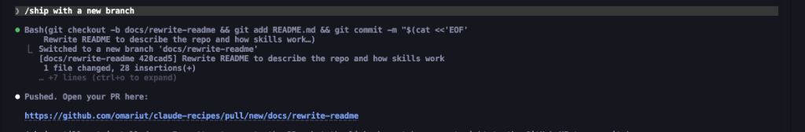

# claude-recipes

A collection of reusable Claude Code skills — slash commands that automate common development workflows directly in your terminal.

## What's a skill?

Skills are markdown files that Claude Code loads as slash commands. Drop one into your project's `skills/` directory (or a global skills folder), and it becomes a `/command` you can invoke mid-conversation. Each skill defines a specific workflow with step-by-step instructions that Claude follows precisely.

## Skills

| Skill | Command | Description |
|-------|---------|-------------|
| [ship](skills/ship.md) | `/ship [description]` | Derive a branch name, commit staged changes, push, and open a PR — all in one step |

## Usage

1. Copy the skill file into your project's `skills/` directory.
2. Open Claude Code in that project.
3. Invoke the command — e.g. `/ship add dark mode`.

Pass optional arguments after the command name to guide branch naming and PR titles.

## Contributing

Each skill lives in its own markdown file under `skills/`. To add one:

- Name the file after the command (e.g. `skills/deploy.md`).
- Start with a one-line summary, then list numbered steps Claude should follow.
- Include an **Arguments** section if the command takes input, and a **Safety rules** section for anything destructive or irreversible.
